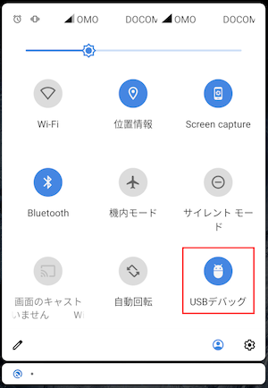

# UsbDebugButton

A quick settings button to quickly toggle USB debug.



This app can be installed on Android 7 or later.

[Download APK file](https://github.com/kobayu777/UsbDebugButton/releases)

## Installation

Install the apk file.

```
$ adb install usb-debug-button.apk
```

Manually add permissions.

```
$ adb shell pm grant net.playdoor.usbdebugbutton android.permission.WRITE_SECURE_SETTINGS
```

